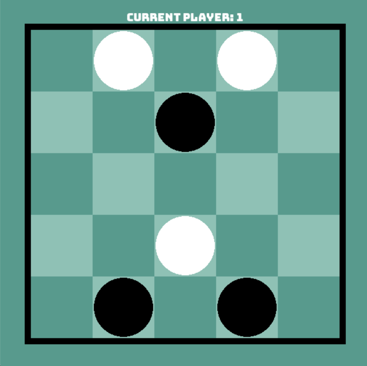

# Neutreeko_Game
- This project was developed for the EIACD (Elements of Artificial Intelligence and Data Science) course, led by Professor Luis Paulo Reis.
- The game Neutreeko was created by Jan Kristian Haugland and can be accessed [here](https://www.neutreeko.net/neutreeko.htm).

- The objective of the game is to align three pieces in a row, vertically, horizontally, or diagonally.
- Players can only move to the furthest available position in those directions.
- A draw is declared when the board configuration repeats itself three times.
  




## Description

- The aim of this project was to develop a game algorithm that simulates Neutreeko and employs search methods, thereby enhancing our coding expertise through the implementation and evaluation of AI models like Minimax and Negamax.

## Getting Started

### Dependencies

- This project requires the following dependencies:

- **Python**
- **Pygame**
- **NumPy**

#### Used libraries

- Copy: Used for duplicating objects.
- Random: Generates random numbers and performs random selections.
- Math: Provides basic mathematical functions and constants.
- NumPy: Supports large, multi-dimensional arrays and matrices for numerical computations.
- Pygame: Facilitates game development with capabilities for graphics and sound.
- Sys: Accesses system-specific parameters and functions.
- Os: Interacts with the operating system for file and directory management.


#### Playing the Game

- To play the game, you need to first import the Pygame ang NumPy library and then run the main game script. Follow these instructions:

**Import Pygame and NumPy**

- Ensure that Pygame and NumPy is installed in your Python environment. If not installed, you can install it using pip:

```bash
pip install pygame

```
```bash
pip install numpy

```

- To start the game, navigate to the directory containing main.py and execute the following command in the terminal:

```bash
python main.py

```

### Team T2C_G4

- Isabela Britto Cartaxo
- Rafael Arruda Costa

